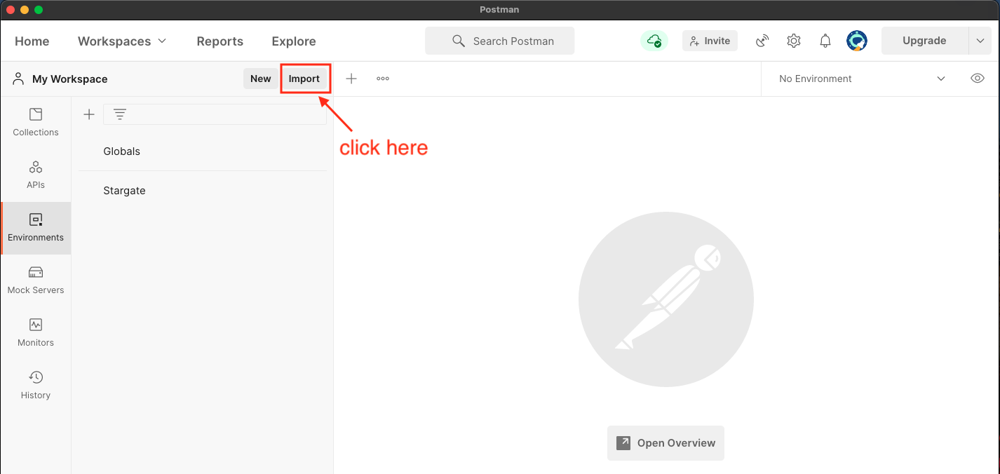
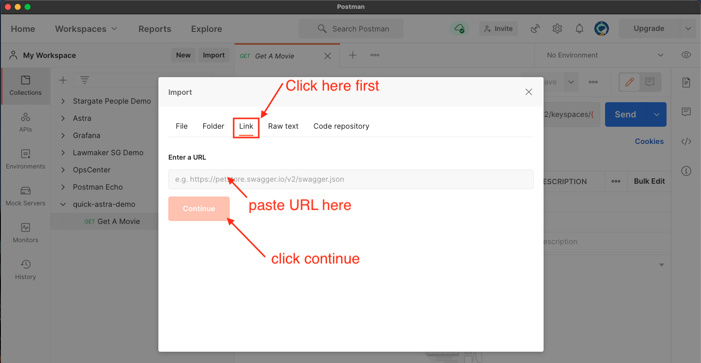
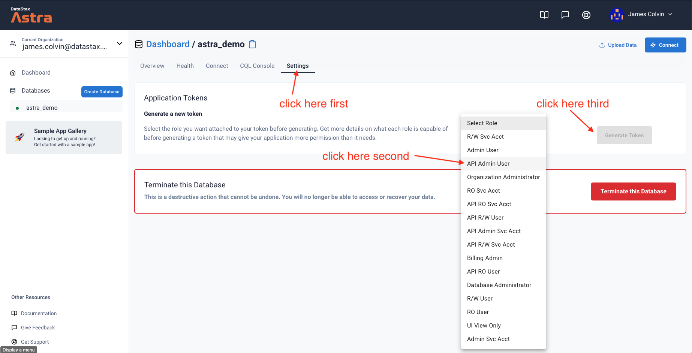
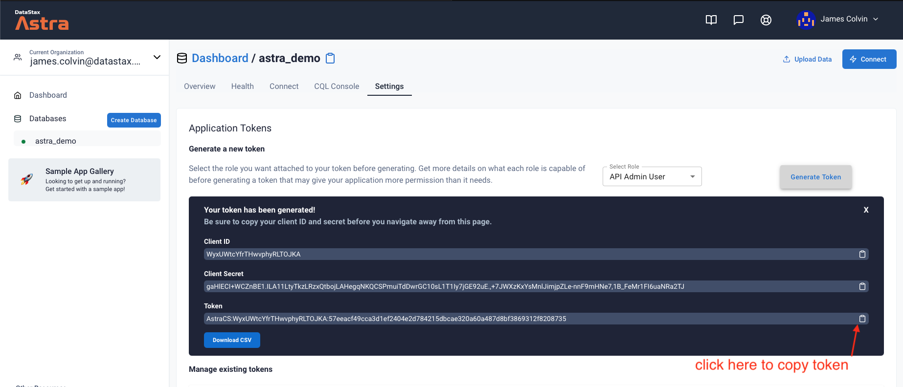
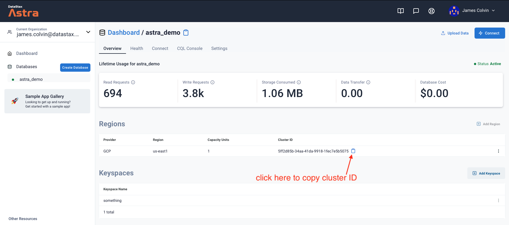
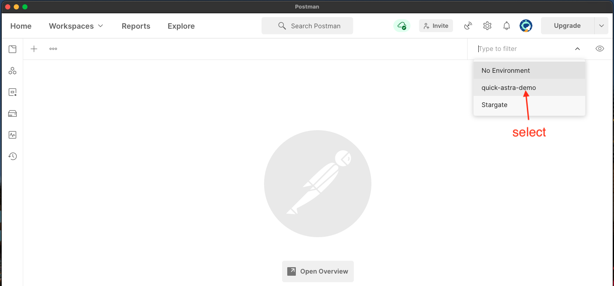
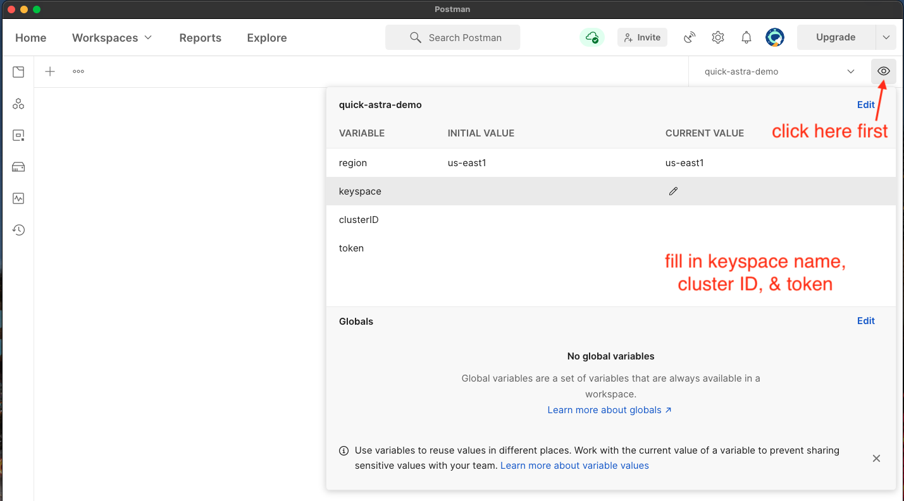

# Quick Astra Demo
### Quick public demo on Astra &amp; Stargate REST API
[Sign up and download Postman here](https://identity.getpostman.com/signup?continue=https%3A%2F%2Fgo.postman.co%2Fbuild) (you'll only have to do this once)
- Click Import



- Copy this URL
```
https://raw.githubusercontent.com/jamesc127/quick-stargate-demo/main/postman/quick-astra-demo.postman_environment.json
```
- Click Link, Paste URL, Click Import



- Click Import again
- Copy this URL and repeat the above process
```
https://raw.githubusercontent.com/jamesc127/quick-stargate-demo/main/postman/quick-astra-demo.postman_collection.json
```


- Create an Auth Token on the Astra website




- Copy your cluster ID



- Fill in your database information to Postman's variables


  

- If everything is filled out correctly, 
you should be able to use the `GET` request called `Get A Movie` 
and see a response